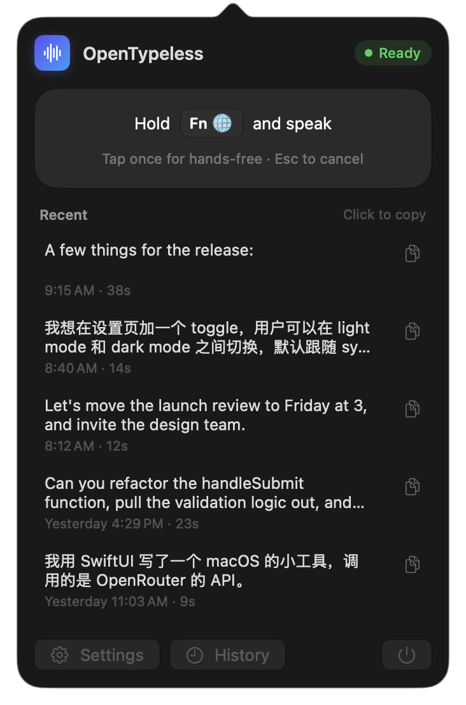
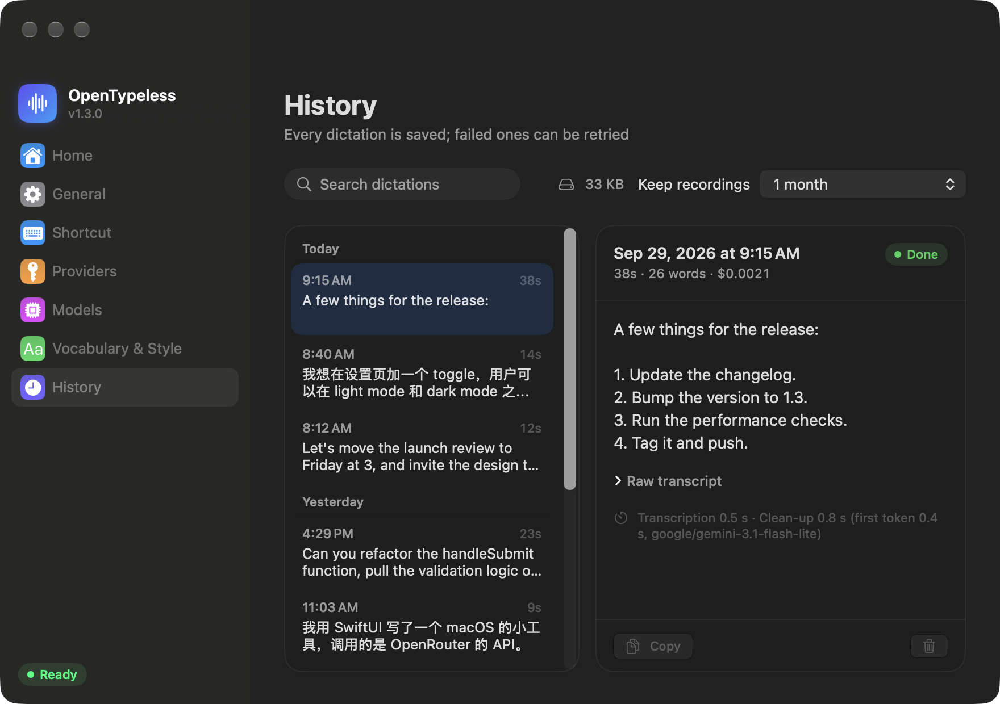
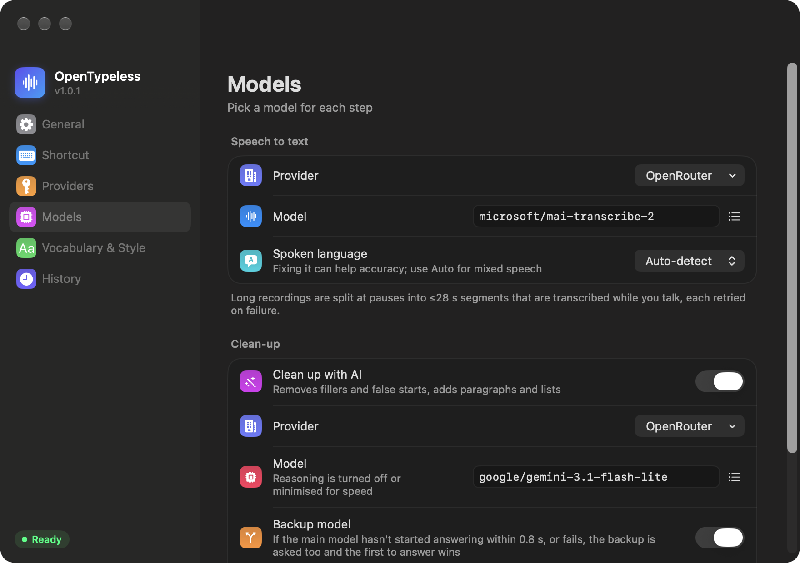
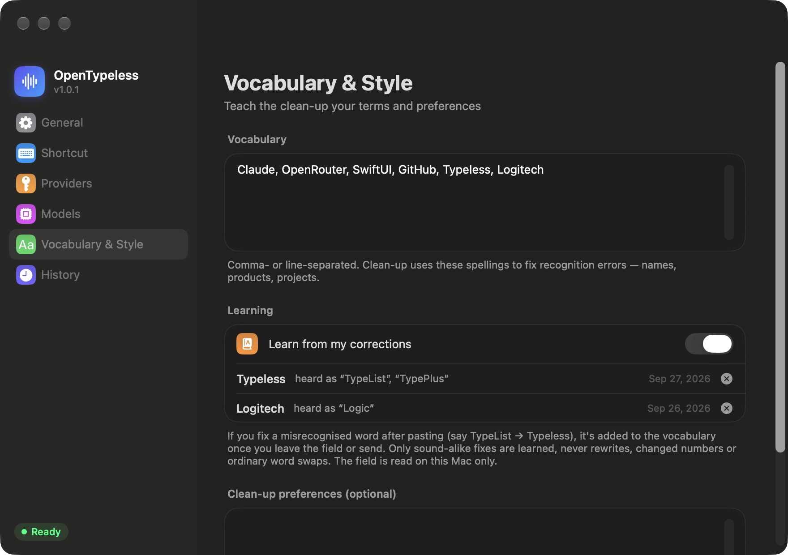

<p align="center">
  <a href="README.md">English</a> · <a href="README.zh-CN.md">简体中文</a> · <b>日本語</b> · <a href="README.ko.md">한국어</a> · <a href="README.es.md">Español</a> · <a href="README.pt-BR.md">Português</a> · <a href="README.fr.md">Français</a> · <a href="README.de.md">Deutsch</a> · <a href="README.ru.md">Русский</a>
</p>

<p align="center">
  
</p>

<h1 align="center">OpenTypeless</h1>

<p align="center">
  <b>長い口述でも崩れない、macOS と Windows のネイティブ音声入力。</b><br>
  キーを押したまま好きなだけ話せば、カーソル位置に整った読みやすいテキストが入ります。
</p>

<p align="center">
  
</p>

<p align="center">
  
</p>

<p align="center">
  2 つのネイティブアプリ、1 つの設計：<b>macOS</b>（Swift / SwiftUI）と <b>Windows</b>（C# / WinUI 3）。<br>
  処理の流れ、整形プロンプト、設定、失敗時の扱いはすべて同じで、異なるのはシステム連携と見た目だけです。
</p>

---

## なぜ作ったのか

音声入力は、AI ツールに長いプロンプトを書くいちばん速い方法です。そのぶん口述も長くなります。考えながら 1〜3 分話すのはごく普通のことです。

オープンソースでも商用でも、多くの音声入力アプリは一文ならうまく動きますが、**まさにこの長い口述で失敗します**。40 秒、1 分、2 分と録音すると、タイムアウトしたり、結果が空だったり、テキストが消えたりします。いくつかのオープンソース製品のソースを読むと、原因はいつも同じでした。

- **録音全体を 1 回の文字起こしリクエストで送っている。** 上流のプロバイダは処理が約 60 秒を超えるとタイムアウトします（OpenRouter はドキュメントに明記しています）。長く話すほど、リクエストが失敗しやすくなります。
- **整形用の LLM 呼び出しに短い*合計*タイムアウトがある。** ストリーミングも含めて 30 秒で打ち切ると、長い応答が途中で切れます。
- **1 回の失敗ですべてを失う。** 2 分間話した内容が消え、最初から言い直すことになります。

OpenTypeless はこの問題を中心に作られています。

## 長い口述への対処

| | 仕組み |
|---|---|
| **間で分割** | 話している間、音声は各区間でいちばん静かな 0.4 秒の位置で 18〜28 秒のセグメントに切られます。単語が途中で切れることはなく、どのリクエストも上流の 60 秒制限に近づきません。 |
| **話しながら文字起こし** | 各セグメントは切り出された時点でバックグラウンドで文字起こしされます。2 分の口述でも、キーを離したときに処理が残っているのは最後の数秒だけです。 |
| **セグメントごとに再試行** | ネットワーク切断、429、5xx エラーはバックオフを挟んで再試行します。無効なキーや支払いのエラーはすぐに失敗として報告します。1 つのセグメントの失敗がほかに影響することはなく、失敗したセグメントは最後にもう一巡まとめて再試行されます。 |
| **出だしが遅いときの予備モデル** | 整形モデルが 0.55 秒以内に応答を始めない、または失敗した場合は、別ベンダーの予備モデルにも同時に依頼し、先に応答した方を使います。上流が遅くても余分にかかるのは 1 秒未満で、待ち時間がまるごと延びることはありません。 |
| **合計ではなく無通信のタイムアウト** | 整形ステップは応答をストリーミングで受け取り、25 秒間*まったく*データが来ないときだけ止まったと判断します。長い出力が途中で切れることはありません。 |
| **言葉を失わない** | 音声は話している間にディスクへ書き込まれます。すべての音声入力は履歴に残り、失敗したものは後で再試行でき、再送されるのは失敗したセグメントだけです。整形に失敗した場合は、元の文字起こしを挿入します。 |

たとえば 121 秒の合成音声は、自然な間で 6 つのセグメントに分割されます。話し終えた時点で、そのうち 5 つはすでに文字起こし済みです。

## 自分でタイプしたような仕上がり

文字起こしそのままの文章は読みにくいものです。言いよどみ、言い直し、「いや、そうじゃなくて…」、考えながらの独り言。整形ステップはそれを、あなたが本来タイプしたであろう文章にします。

- **言い直しは最後の内容を採用。** 「水曜、いや木曜」→ 木曜。だいぶ後になってからの訂正、暗黙の訂正（「5 万、えーと、念のため 6 万」）、まるごと取り消した話（「…3 つ目は、やっぱりなし」）にも対応します。
- **言いよどみや独り言を削除。** um / uh / 嗯 / 那个 / 「ちょっと考えさせて」/「まあそんなところ」などはすべて消えます。
- **実際の内容は失わない。** 数字、バージョン、名前、比較はそのまま残します。モデルには「自分が知らない新しい製品も実在する」と伝えてあるので、「Gemini 3.5」が「Gemini 2.5」に書き換えられることはありません。
- **必要なときだけ構造化。** 3 つ以上の並列する項目は番号付きリストにし、それ以外は普通の段落のままにします。
- **質問に答えない。** 口述したプロンプト（「なぜ…なのか説明して」）は整形されるだけで、回答や実行はされません。
- **あなたの言葉、あなたの言語。** 編集は最小限で、言い回し、順序、口調はそのまま残ります。中国語と英語を混ぜて話した場合、日常語も含めて（「shortcut」「dark mode」）すべての単語が話したときの言語のまま残り、CJK と欧文の間にはスペースが入ります。

<p align="center">
  
</p>

プロンプトは開発用とホールドアウトのテストセット（[eval/](eval/) を参照）で調整されており、実際の口述も含まれています。

## 機能

- **グローバルショートカット。** デフォルトでは **Fn**（macOS）または **右 Ctrl**（Windows）を押したままにします。任意の修飾キー 1 つ（右 ⌘、右 ⌥、右 Alt…）や組み合わせ（⌥ Space、Alt + Space、F5…）も記録できます。
- **押して話すか、ハンズフリー。** 押したまま話します。1 回タップするとハンズフリーで録音が続き、もう一度タップすると終了します。**Esc** でキャンセルします。10 秒以上話してからキャンセルした場合は失われず、文字起こしされ（挿入はされません）、履歴に 24 時間残ります。
- **マイクを選択**：**設定 → 一般** で選び、ライブのレベルメーターで声が届いているか確認できます。仮想デバイス（会議・配信アプリ）には印が付き、選んだデバイスが外れるとシステムの既定に戻ります。
- **マイクを待機させる**（オプション）：キーを押した瞬間に録音が始まり、押す直前の音も含まれるので、最初の言葉が切れません。マイクはオンのままで、Bluetooth ヘッドホンは通話モードに切り替わります。
- **ライブプレビュー（ベータ）**：話している言葉が録音カプセルの上に表示されます。認識はデバイス上で行われます（macOS は SpeechAnalyzer、Windows は音声認識）。挿入されるテキストは引き続きプロバイダから届きます。
- **カーソル位置にペースト。** テキスト欄ではペーストしてからクリップボードを元に戻します。テキスト欄にフォーカスがないときはクリップボードに入ります。ブラウザや Electron アプリにも、Windows ではターミナルにも対応しています。
- **プロバイダは自由に選択。** OpenRouter、OpenAI、Groq、SiliconFlow、DeepSeek、または OpenAI 互換の任意のエンドポイント。文字起こし、整形、予備の整形モデルでそれぞれ別のプロバイダを使えます。**テスト** はキーを確認し、プロバイダの往復レイテンシ（3 回の中央値）を表示します。
- **予備の音声認識**（オプション）：ある区間が、その長さに対していつもよりかなり時間がかかるか失敗した場合、2 つ目のプロバイダにも依頼し、先に返ってきた結果を使います。
- **カスタム語彙とスタイルの好み。** 人名、製品名、専門用語に使えます。
- **あなたの修正から学習。** ペースト後に誤認識された単語を直すと（TypeList → Typeless）、どう聞き間違えたかと一緒に自動で語彙に追加されます。学習するのは発音が似ている修正だけで、書き換え、数字の変更、普通の単語の置き換えは学習しません。削除した単語が再び学習されることもありません。
- **ホーム画面**では、音声入力がもたらしたものを確認できます。話した文字数、タイピングと比べて節約できた時間（デフォルトは毎分 100 字、変更可）、話す速さ、今日・今月・累計の費用、連続日数付きの GitHub 風アクティビティヒートマップ。自分でアプリを開いたときに表示され、ログイン時は **ログイン時の起動でもホームを表示** をオンにしない限り邪魔をしません。
- **費用がわかる。** OpenRouter のリクエストは OpenRouter が実際に請求した額で計算し、各モデルの横にリアルタイムの価格を表示します。その他のプロバイダやカスタムエンドポイントは、**モデル** でモデルの価格（100 万トークンあたり、文字起こしは音声 1 分あたり）を入力してください。
- **履歴**にはすべての音声入力が日ごとにまとめて残り、検索でき、元のテキストと整形後のテキスト、所要時間、費用とともに、コピーや再度の文字起こしができます。録音の保存期間は、保存しない、1 日、1 週間、1 か月、1 年、無期限から選べます。
- **9 つの UI 言語**：English、简体中文、日本語、한국어、Español、Português、Français、Deutsch、Русский。システムの言語に従うほか、**設定 → 一般 → 言語** で選べます。
- **ネイティブなデザイン。** macOS 26 以降では Liquid Glass とメニューバーのパネル、Windows 11 では Mica と Acrylic とトレイのパネル。どちらも話している間は小さな録音カプセルを表示します。
- **ログイン時に起動。**
- **自動アップデート。** 1 日 1 回 GitHub Releases を確認し、新しいバージョンをバックグラウンドでダウンロードして、**再起動して更新** をクリックしたときにインストールします。音声入力の途中で行うことはありません。ファイルを置き換える前に、ダウンロードを GitHub の SHA-256 と照合します。**設定 → 一般 → アップデート** でオフにしたり、手動で確認したりできます。
- **小さくてネイティブ。** macOS では約 3 MB の Swift/SwiftUI アプリ、Windows では自己完結型の WinUI 3 アプリ。Electron もアカウントも独自サーバーもありません。

<table>
  <tr>
    <td width="50%"></td>
    <td width="50%"></td>
  </tr>
  <tr>
    <td align="center">ステップごとにプロバイダとモデルを選択、予備の整形モデルも</td>
    <td align="center">修正から学習した単語を含む語彙</td>
  </tr>
</table>


## 動作環境

- **macOS：** macOS 26 以降、Apple シリコン。
- **Windows：** Windows 10（バージョン 2004 以降）または Windows 11、x64 または ARM64。
- 少なくとも 1 つのプロバイダの API キー（[OpenRouter](https://openrouter.ai/keys) がいちばん簡単です。1 つのキーで両方のステップをまかなえます）。

## macOS へのインストール

### ダウンロード

1. [Releases](https://github.com/Tyler913/OpenTypeless/releases) から `OpenTypeless-<version>-macOS-arm64.zip` をダウンロードして展開します。
2. **OpenTypeless.app** を **アプリケーション** フォルダに移動します。
3. このアプリは Apple の公証を受けていない（有料の開発者アカウントが必要）ため、初回起動時に macOS がブロックし、「壊れているため開けません」と表示されることもあります。ターミナルでダウンロードの隔離フラグを一度だけ外してください。

   ```bash
   xattr -dr com.apple.quarantine /Applications/OpenTypeless.app
   ```

   そのあと普通に開きます。

   ```bash
   open /Applications/OpenTypeless.app
   ```

   または、一度開こうとしてから **システム設定 → プライバシーとセキュリティ** で **このまま開く** をクリックします。

OpenTypeless は Dock ではなくメニューバー（波形アイコン）にいます。

以降のバージョンはアプリ内（**設定 → 一般 → アップデート**）からインストールでき、ターミナルの操作は不要です。macOS が確認するのはブラウザでダウンロードしたアプリだけだからです。

### ソースからビルド

Xcode 26 以降が必要です（コマンドラインツールだけでもコンパイルできますが、ビルド時に `/Applications/Xcode.app` の SwiftUI マクロプラグインを借ります）。

```bash
git clone https://github.com/Tyler913/OpenTypeless.git
cd OpenTypeless/macos
scripts/create-signing-cert.sh   # 任意だが推奨、1 回だけ
scripts/build-app.sh             # ビルド、署名し、/Applications/OpenTypeless.app にインストール
```

`create-signing-cert.sh` はローカルのコード署名 ID を作成します。これがないとアプリはアドホック署名になり、ビルドし直すたびに macOS がアクセシビリティとマイクの許可を求め直します。

インストールせずにリリース用の zip を作るには、`scripts/build-app.sh --package` を実行します。`macos/dist/OpenTypeless-<version>-macOS-arm64.zip`（アドホック署名）を書き出し、その SHA-256 を表示します。

`build-app.sh` はマシン上のアプリを常に 1 つだけに保ちます。隠しのステージングフォルダでバンドルを組み立てて `/Applications` に移動し、古いコピーを LaunchServices から登録解除し、署名が変わったときは古くなったプライバシー設定を消去します。

### 初回起動

1. **マイク** と **アクセシビリティ** へのアクセスを許可します（アクセシビリティはショートカットの検知とテキストのペーストに使います）。
2. **設定 → プロバイダ** で API キーを追加します。
3. Fn を使う場合は、**システム設定 → キーボード →「🌐キーを押して」** を **何もしない** にしておくと、Fn をタップしても絵文字ピッカーが開きません。

## Windows へのインストール

### ダウンロード

1. [Releases](https://github.com/Tyler913/OpenTypeless/releases) から `OpenTypeless-<version>-windows-x64.zip`（または `-arm64`）をダウンロードし、任意の場所（たとえば `%LOCALAPPDATA%\Programs`）に展開します。
2. **OpenTypeless.exe** を実行します。自己完結型なので、ほかにインストールするものはありません。
3. アプリはコード署名されていないため、SmartScreen が「Windows によって PC が保護されました」と表示することがあります。**詳細情報 → 実行** をクリックしてください。

以降のバージョンはアプリ内（**設定 → 一般 → アップデート**）から同じフォルダにインストールされ、SmartScreen の確認は出ません。`%LOCALAPPDATA%\Programs` のような書き込みできる場所に展開してください。`Program Files` に置いた場合、アプリはダウンロードへのリンクを示すことしかできません。

OpenTypeless は**通知領域**（時計の隣の波形アイコン）にいます。Windows は新しいアイコンを最初はオーバーフロー（^）に隠すので、タスクバーにドラッグするか、**設定 → 個人用設定 → タスク バー → その他のシステム トレイ アイコン** でオンにしてください。

### ソースからビルド

[.NET 10 SDK](https://dotnet.microsoft.com/download) が必要です。Visual Studio は任意です。

```powershell
# このリポジトリのクローンの windows\ で
powershell -ExecutionPolicy Bypass -File scripts\build.ps1            # テスト、ビルドし、%LOCALAPPDATA%\Programs\OpenTypeless にインストール
powershell -ExecutionPolicy Bypass -File scripts\build.ps1 -Package   # windows\dist\OpenTypeless-<version>-windows-x64.zip を書き出す
```

`build.ps1` はインストール済みのコピーを常に 1 つだけに保ちます。実行中のアプリを止め、インストールフォルダを置き換え、スタートメニューのショートカットを更新して、新しいビルドを起動します。ARM 版 Windows では `-Arch arm64` を付けてください。

Windows アプリの開発に Windows PC は必要ありません。変更のたびに GitHub Actions がビルドします（[継続的インテグレーション](#継続的インテグレーション) を参照）。

### 初回起動

1. **設定 → プロバイダ** で API キーを追加します。
2. **設定 → プライバシーとセキュリティ → マイク → デスクトップ アプリがマイクにアクセスできるようにする** がオンになっていることを確認します。
3. 右 Ctrl を押したまま話します。Windows ではアクセシビリティの許可は不要です。唯一の制限は、管理者として実行中のアプリにはペーストできないことで、その場合テキストはクリップボードに入ります。

## デフォルトのモデル

| ステップ | デフォルト | 補足 |
|---|---|---|
| 文字起こし | `microsoft/mai-transcribe-2`（OpenRouter） | OpenRouter の任意の文字起こしモデル、またはほかのプロバイダの Whisper 互換 `/audio/transcriptions`。 |
| 整形 | `google/gemini-3.8-flash`（OpenRouter） | 私たちのテストで最も整形がうまく、長い口述 1 回あたり約 0.005 ドル。より安い選択肢：`qwen/qwen3.7-flash`、`google/gemini-3.1-flash-lite`。 |
| 予備の整形 | `deepseek/deepseek-v4.1-flash`（OpenRouter） | メインのモデルの出だしが遅いか失敗したときだけ使われます。別ベンダーの高速なモデルを選んでください。 |

遅延を抑えるため、整形モデルの推論（reasoning）は自動でオフまたは最小になります。

## プライバシー

- 音声とテキストは、あなたが設定したプロバイダにだけ送信されます。**ライブプレビュー** をオンにすると、macOS は Mac 上で音声を認識します。Windows は自身の音声認識を使い、オンライン音声認識が有効な場合は音声が Microsoft に送信されます（設定に記載があります）。
- API キーは macOS のキーチェーン、または Windows の資格情報マネージャー（1 件、`OpenTypeless/credentials`）に保存されます。
- ホーム画面用の利用量（1 日ごとの文字数、話した時間、費用。テキストは含まない）は、設定や履歴と同じフォルダの `usage.json` に保存されます。OpenRouter の価格表は、公開のモデル一覧から 1 日に数回ダウンロードされます（キー不要、あなたに関する情報は送りません）。
- 履歴（音声 + 文字起こし）は、macOS では `~/Library/Application Support/OpenTypeless/Sessions/`、Windows では `%LOCALAPPDATA%\OpenTypeless\` にあります。録音はデフォルトで 1 か月保存されます（履歴ページで、保存しない、1 日、1 週間、1 か月、1 年、無期限から選択）。その後もテキストは最新 200 件の中に残ります。失敗した音声入力は再試行できるよう音声を保持します。
- アップデートの確認は 1 日 1 回 `api.github.com` にリクエストを送ります（アカウント不要、あなたや音声入力の情報は送りません）。**設定 → 一般 → アップデート** でオフにできます。
- 修正からの学習では、音声入力したテキスト欄を、あなたのコンピュータ上だけで、ペースト後最大 2 分間読み取ります。パスワード欄は対象外です。**語彙とスタイル** でオフにできます。

## 開発

このリポジトリには両方のアプリが入っています。設計、評価セット、この README を共有し、コード、テスト、ビルドスクリプトはそれぞれにあります。

```
macos/                      macOS アプリ（Swift Package）
  Sources/TypelessCore/       UI を含まない処理ロジック：分割、WAV、プロバイダクライアント、再試行、整形プロンプト
  Sources/OpenTypeless/       アプリ本体：ショートカット、録音、HUD、設定、履歴、ペースト、CLI ツール
  Tests/                      swift-testing のテスト
  scripts/                    ビルド、署名、アイコン、テストのスクリプト
windows/                    Windows アプリ（.NET ソリューション）
  src/TypelessCore/           同じ処理ロジックを 1 行ずつ移植
  src/OpenTypeless/           WinUI アプリ：キーボードフック、WASAPI 録音、HUD、トレイ、設定、履歴、ペースト
  src/OpenTypeless.Cli/       コマンドラインツール（ファイルの文字起こし、分割の分析、プロンプト評価）
  tests/                      xUnit のテスト
  scripts/                    ビルド、テスト、アイコンのスクリプト
eval/                       整形のテストセットと評価ガイド（両アプリ共通）
i18n/                       UI の翻訳（中国語と英語以外、両アプリ共通）
docs/DESIGN.md              アーキテクチャと設計判断
docs/WINDOWS-PORT.md        macOS の各ファイルとシステム API の Windows での対応
docs/images/                README のスクリーンショット
```

整形プロンプト（`Prompts.swift` / `Prompts.cs`）は両アプリでバイト単位まで同一です。変更するときは両方を一緒に変え、[eval/](eval/) で結果を確認してください。

### 翻訳

ユーザーに見えるすべての文字列は、中国語と英語をその場に書きます。Swift では `L("有新版本 \(version)", "Version \(version) is available")`、C# では `L($"有新版本 {version}", $"Version {version} is available")` です。ほかの言語は [`i18n/strings.json`](i18n/strings.json) にあり、英語のテキストをキーとし、埋め込み値には順に番号を振ります。

```json
"Version {0} is available": { "ja": "バージョン {0} が利用可能です", "ko": "버전 {0} 사용 가능", … }
```

両アプリはビルド時にこのファイルを埋め込み、翻訳のない文字列は英語で表示されます。翻訳ではプレースホルダーの位置を変えてもかまいませんが、すべて残す必要があります。文字列を追加・変更したら翻訳を追加し、`python3 i18n/check.py` を実行してください。欠けている、使われていない、形式が正しくないエントリを一覧表示します。CI もすべてのプルリクエストで実行します。実際の画面で言語を確認するには、`--snapshot-ui` と `--lang ja`（またはほかの言語コード）で UI をレンダリングします。

### macOS

```bash
cd macos
swift build
scripts/test.sh                  # ユニットテスト（130 秒の録音に障害を注入するモックサーバーを含む）
```

ビルドしたバイナリの便利なコマンドラインモード（`macos/` で実行）：

```bash
# 音声ファイルで処理全体を実行。--realtime は話す速さで音声を送り、実際のマイクのように振る舞う
.build/debug/OpenTypeless --transcribe-file speech.m4a --realtime

# 分割の位置を表示
.build/debug/OpenTypeless --transcribe-file speech.m4a --chunks-only

# 整形プロンプトとモデルを評価（eval/README.md を参照）
.build/debug/OpenTypeless --eval-polish ../eval/polish-holdout.json --model google/gemini-3.8-flash ...

# 設定ページ、メニューバーのパネル、HUD を PNG に書き出す（--live は画面に表示して本物の Liquid Glass で撮影）。
# README のスクリーンショットはサンプルの履歴と、許可済みとして扱う --demo を使っています。
OPENTYPELESS_SUPPORT_DIR=/path/to/sample-data .build/debug/OpenTypeless --snapshot-ui /tmp/shots --live --demo --lang en
```

### Windows

```powershell
cd windows
dotnet build OpenTypeless.slnx
scripts\test.ps1       # ユニットテスト（130 秒の録音に障害を注入するモックサーバーを含む）
```

コマンドラインツール（`OpenTypeless.Cli.exe`。アプリと一緒に配布され、アプリの設定とキーを使います）：

```powershell
# 音声ファイル（WAV、MP3、M4A、WMA、FLAC…）で処理全体を実行。--realtime は話す速さで音声を送る
OpenTypeless.Cli --transcribe-file speech.m4a --realtime

# 分割の位置を表示
OpenTypeless.Cli --transcribe-file speech.m4a --chunks-only

# 整形プロンプトとモデルを評価（eval/README.md を参照）
OpenTypeless.Cli --eval-polish ..\eval\polish-holdout.json --models google/gemini-3.8-flash --out ...

# すべての設定ページ、トレイのパネル、HUD の各状態を PNG に書き出す
# （--lang en|zh|ja|… で 1 言語のみ、--demo は許可済みとして扱う。OPENTYPELESS_DATA_DIR とサンプルの履歴と組み合わせる）
OpenTypeless --snapshot-ui C:\temp\snapshots
```

開発用の環境変数（Windows）：

| 変数 | 効果 |
|---|---|
| `OPENROUTER_API_KEY` | 保存された OpenRouter のキーを上書きします。 |
| `OPENTYPELESS_DATA_DIR` | 設定と履歴に別のフォルダを使います（テストに便利）。 |
| `OPENTYPELESS_DEBUG` | ショートカット / セッション / フォーカスのイベントをデータフォルダの `debug.log` に書き込みます。 |
| `OPENTYPELESS_TEST_AUDIO` | マイクの代わりに 16 kHz モノラルの WAV をリアルタイムで流します（エンドツーエンドのテスト用）。 |

### コントリビュート

`main` は保護されており、すべての変更はプルリクエストを通します。ブランチで作業し、`main` へのプルリクエストを作成して、**CI passed** のチェックが緑になったらマージしてください。

### 継続的インテグレーション

GitHub Actions（[`.github/workflows/`](.github/workflows/)）は変更したアプリだけをビルドします。

| 変更した場所 | 実行されるもの |
|---|---|
| `macos/**` | macOS ランナーで **macOS build**：テストしてからアプリの zip を作成。 |
| `windows/**` | Windows ランナーで **Windows build**：テストしてから x64 と ARM64 の zip を作成。 |
| `testdata/**` | 両方のビルド：両方のテストスイートが読む共通のテストケース（文字数、価格、節約できた時間）。2 つのアプリの結果を一致させるためです。 |
| `i18n/**` | 両方のビルド：両アプリが埋め込む翻訳。 |
| `docs/`、`eval/`、`README*.md` だけ | 何もビルドしません。 |

どの実行でも翻訳のチェック（**Translations**、`python3 i18n/check.py`）が行われます。

zip は Actions タブの各実行の **Artifacts** からダウンロードできます。**Actions → macOS build / Windows build → Run workflow** で手動ビルドを開始できます。

リリースするには、両アプリのバージョン（`macos/scripts/build-app.sh`、`windows/Directory.Build.props`）を上げ、タグを 1 つ（`1.0.2` または `V1.0.2`）プッシュします。両アプリをビルドし、「OpenTypeless V1.0.2」という**下書き**のリリースを 1 つ作成します。中身は macOS の zip（リリース証明書で署名）と Windows の x64 と ARM64 の zip です。zip のバージョンがタグと一致しない場合、ビルドは失敗します。

下書きを確認して手動で公開すると、それが最新リリースになります。インストール済みのコピーは 1 日以内にそれを見つけます。アプリ内のアップデーターは、自分のプラットフォーム用の zip（`OpenTypeless-<version>-macOS-arm64.zip`、`-windows-x64.zip`、`-windows-arm64.zip`）を含む、公開済みでプレリリースでない最新のリリースを探します。配布したくないリリースはプレリリースにしてください。

**macOS のリリース署名（1 回だけ）。** macOS はアクセシビリティとマイクの許可をアプリの署名に結び付けるため、リリースは常に同じ証明書で署名すべきです。そうしないと、アップデートのたびにユーザーは両方の許可を求められます。`macos/scripts/create-release-cert.sh` を実行し、書き出された `.p12` を安全な場所に保管して、表示される 2 つのリポジトリシークレット（`MACOS_SIGNING_CERTIFICATE`、`MACOS_SIGNING_CERTIFICATE_PASSWORD`）を追加します。以降のリリースビルドはそれで署名されます。シークレットがない場合はアドホック署名になり、実行に警告が表示されます。

## 謝辞

Typeless に着想を得ています。システム連携の手法は、オープンソースの [VoiceInk](https://github.com/Beingpax/VoiceInk)、[OpenLess](https://github.com/Open-Less/openless)、[OpenTypeless (tover0314-w)](https://github.com/tover0314-w/opentypeless) から学びました。本プロジェクトは独立しており、これらのいずれとも関係はありません。

## ライセンス

[MIT](LICENSE)
