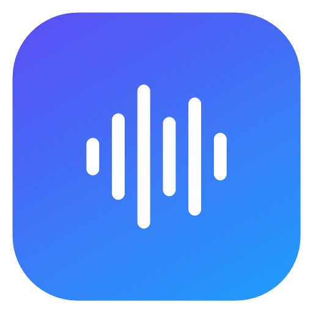

<p align="center">
  
</p>

<h1 align="center">OpenTypeless for Windows</h1>

<p align="center">
  <b>Native Windows voice typing that doesn't fall apart on long dictation.</b><br>
  Hold a key, talk for as long as you need, and get clean, structured text at your cursor.
</p>

---

This is the Windows version of [OpenTypeless](https://github.com/Tyler913/OpenTypeless), rebuilt natively on
**WinUI 3 / Windows App SDK** (C#, .NET 10). It has the same pipeline, the same clean-up prompt, the same settings
and the same failure handling as the macOS app; only the system integration and the look are Windows-specific.
See [docs/WINDOWS-PORT.md](docs/WINDOWS-PORT.md) for the file-by-file mapping.

## Why this exists

Voice typing is the fastest way to write long prompts for AI tools, and that means long dictations: one to three
minutes of thinking out loud is normal. Most voice-typing apps work fine for a sentence and then **fail on exactly
those long dictations**:

- **The whole recording is sent as one speech-to-text request**, and upstream providers time out after about 60 s.
- **The clean-up LLM call has a short *total* timeout**, which kills a long answer halfway through.
- **One failure throws everything away.**

## How it handles long dictation

| | What happens |
|---|---|
| **Chunk at pauses** | While you talk, audio is cut into 18–28 s segments at the quietest 0.4 s window in each span, so words are never cut in half and no request comes close to the upstream 60 s limit. |
| **Transcribe while you talk** | Each segment is transcribed in the background as soon as it is cut. After a two-minute dictation, only the last few seconds are left to process when you release the key. |
| **Retry per segment** | Network drops, 429s and 5xx errors are retried with backoff. Bad keys and billing errors fail fast. Failed segments get one more full round at the end. |
| **Backup model for slow starts** | If the clean-up model hasn't started answering within 0.8 s, or fails, a backup model from another vendor is asked too and whichever answers first wins. A slow upstream provider costs under a second more, not the whole wait. |
| **Idle timeout, not total timeout** | Clean-up streams its answer and is only considered stuck when *no* data arrives for 25 s. |
| **Never lose words** | Audio is written to disk as you speak. Every dictation is kept in History; a failed one can be retried later, and only its failed segments are re-sent. If clean-up fails, the raw transcript is inserted instead. |

## Clean-up that reads like you typed it

Self-corrections resolved (the final version wins), filler and thinking-out-loud removed, every number, name and
version kept exactly, numbered lists only when you enumerate three or more parallel points, and dictated prompts are
cleaned up, never answered. Edits are kept to a minimum: wording, order and tone stay yours. When you mix Chinese and
English, every word stays in the language you said it in, everyday words too ("shortcut", "dark mode"). The prompt is
identical to the macOS app's and is tuned against the development and held-out sets in [eval/](eval/).

## Features

- **Global hotkey.** Hold **Right Ctrl** by default, pick Right Alt / Right Shift, or record any single modifier
  (Left/Right Ctrl, Alt, Shift, Win) or a combination (Alt + Space, Ctrl + Shift + D, F5…).
- **Push-to-talk or hands-free.** Hold to talk; tap once to keep recording hands-free and tap again to finish. **Esc** cancels.
- **Pastes where your cursor is.** The app knows whether the paste really landed (the target app has to ask for the
  text), so your clipboard is restored whenever it did, browsers and Electron apps included, and the temporary entry
  is kept out of clipboard history. If nothing took the text, it stays on the clipboard and the capsule says so.
  Terminals are handled too.
- **Bring your own provider.** OpenRouter, OpenAI, Groq, SiliconFlow, DeepSeek, or any OpenAI-compatible endpoint.
  Speech-to-text, clean-up and the backup clean-up model can each use a different provider.
- **Custom vocabulary and style preferences** for names, products and jargon.
- **Learns from your fixes.** Correct a misrecognised word after it's pasted (TypeList → Typeless) and it's added to
  your vocabulary automatically, along with how it was misheard. Only sound-alike fixes are learned, never rewrites,
  changed numbers or ordinary word swaps, and a word you remove is never learned again.
- **History** of every dictation with raw and cleaned text, timing, copy and re-transcribe. Choose how long recordings
  are kept: not at all, a day, a week, a month, a year, or forever.
- **Bilingual UI** (English / 简体中文), following the system language or chosen manually, switching instantly.
- **Windows 11 design**: Mica settings window, an Acrylic recording capsule, and a tray panel.
- **Open at login.**

## Requirements

- Windows 10 (version 2004 or later) or Windows 11, x64 or ARM64.
- An API key for at least one provider ([OpenRouter](https://openrouter.ai/keys) is the easiest: one key covers both steps).
- To build: the [.NET 10 SDK](https://dotnet.microsoft.com/download). Visual Studio is optional.

## Install

### Download

1. Download `OpenTypeless-<version>-windows-x64.zip` from Releases and unzip it anywhere (e.g. `%LOCALAPPDATA%\Programs`).
2. Run **OpenTypeless.exe**. It's self-contained: nothing else to install.
3. The app isn't code-signed, so SmartScreen may say "Windows protected your PC": click **More info → Run anyway**.

OpenTypeless lives in the **notification area** (waveform icon next to the clock). Windows hides new icons in the
overflow (^) at first; drag it onto the taskbar, or turn it on under **Settings → Personalization → Taskbar → Other
system tray icons**.

### Build from source

```powershell
# from a clone of this repository
powershell -ExecutionPolicy Bypass -File scripts\build.ps1            # tests, builds, installs to %LOCALAPPDATA%\Programs\OpenTypeless
powershell -ExecutionPolicy Bypass -File scripts\build.ps1 -Package   # writes dist\OpenTypeless-<version>-windows-x64.zip
```

`build.ps1` keeps exactly one installed copy: it stops the running app, replaces the install folder, refreshes the
Start menu shortcut and launches the new build. Add `-Arch arm64` for Windows on ARM.

### Build in the cloud (from any computer)

WinUI 3 only compiles on Windows, so GitHub Actions builds the app on a Windows runner
([`.github/workflows/windows.yml`](.github/workflows/windows.yml)). No Windows PC is needed to develop this branch:

- **Every push or pull request to `windows`** runs the tests and builds both `x64` and `arm64` zips. Download them
  from the run's **Artifacts** section on the Actions tab.
- **Pushing a tag like `1.0.1-windows`** also creates a **draft** GitHub Release with both zips attached. Review it
  and publish it by hand; it is never marked as the repository's latest release, which stays the macOS one.
- **Actions → Windows build → Run workflow** starts a build manually.

## First run

1. Add an API key under **Settings → Providers**.
2. Make sure **Settings → Privacy & security → Microphone → Let desktop apps access your microphone** is on.
3. Hold Right Ctrl and talk. Windows needs no accessibility permission; the one limit is that it doesn't allow
   pasting into apps running as administrator, so there the text goes to the clipboard.

## Default models

| Step | Default | Notes |
|---|---|---|
| Speech-to-text | `microsoft/mai-transcribe-2` (OpenRouter) | Any OpenRouter transcription model, or Whisper-compatible `/audio/transcriptions` elsewhere. |
| Clean-up | `google/gemini-3.8-flash` (OpenRouter) | Cheaper options to try: `qwen/qwen3.7-flash`, `google/gemini-3.1-flash-lite`. |
| Backup clean-up | `deepseek/deepseek-v4.1-flash` (OpenRouter) | Only asked when the main model is slow to start or fails. Pick a fast model from another vendor. |

Reasoning is automatically turned off or set to its minimum for the clean-up model, to keep latency low.

## Privacy

- Audio and text are only sent to the providers you configure.
- API keys are stored in Windows Credential Manager (one entry, `OpenTypeless/credentials`).
- Settings and history (audio + transcripts) live in `%LOCALAPPDATA%\OpenTypeless\`. Recordings are kept for a month
  by default (History page: not at all, a day, a week, a month, a year, or forever); after that the text stays among
  the newest 200 entries. Failed dictations keep their audio so they can be retried.
- Learning from your fixes reads the text field you dictated into through UI Automation, on this PC only, for at most
  two minutes after a paste. Password fields are skipped. It can be turned off under **Vocabulary & Style**.

## Development

```powershell
dotnet build OpenTypeless.slnx
scripts\test.ps1       # unit tests, including a mock server that injects failures into a 130 s recording
```

Command-line tools (`OpenTypeless.Cli.exe`, shipped next to the app; it uses the app's settings and keys):

```powershell
# Full pipeline on an audio file (WAV, MP3, M4A, WMA, FLAC…); --realtime feeds audio at speaking speed
OpenTypeless.Cli --transcribe-file speech.m4a --realtime

# Show where the chunker cuts
OpenTypeless.Cli --transcribe-file speech.m4a --chunks-only

# Evaluate clean-up prompts and models (see eval/README.md)
OpenTypeless.Cli --eval-polish eval\polish-holdout.json --models google/gemini-3.8-flash --out ...

# Render every settings page, the tray panel and the HUD states to PNGs
# (--lang en|zh for one language, --demo treats permissions as granted; pair it with OPENTYPELESS_DATA_DIR and sample history)
OpenTypeless --snapshot-ui C:\temp\snapshots
```

Developer environment variables:

| Variable | Effect |
|---|---|
| `OPENROUTER_API_KEY` | Overrides the stored OpenRouter key. |
| `OPENTYPELESS_DATA_DIR` | Uses another folder for settings and history (handy for tests). |
| `OPENTYPELESS_DEBUG` | Writes hotkey / session / focus events to `debug.log` in the data folder. |
| `OPENTYPELESS_TEST_AUDIO` | Streams a 16 kHz mono WAV in real time instead of the microphone, for end-to-end tests. |

Project layout:

```
src/TypelessCore/        Pipeline logic, no UI: chunker, WAV, provider client, retries, clean-up prompt
src/OpenTypeless/        The WinUI app: hotkey hook, WASAPI recorder, HUD, tray, settings, history, paste
src/OpenTypeless.Cli/    Command-line tools (transcribe a file, chunk analysis, prompt evaluation)
tests/                   xUnit suites
eval/                    Clean-up test sets and the evaluation guide
docs/                    macOS → Windows mapping and design notes
scripts/                 Build, test and icon scripts
```

## License

[MIT](LICENSE)
