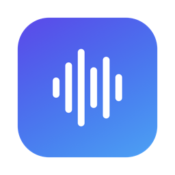

<p align="center">
  
</p>

<h1 align="center">OpenTypeless</h1>

<p align="center">
  <b>Native macOS voice typing that doesn't fall apart on long dictation.</b><br>
  Hold a key, talk for as long as you need, and get clean, structured text at your cursor.
</p>

---

## Why this exists

Voice typing is the fastest way to write long prompts for AI tools. That also means long dictations: one to three minutes of thinking out loud is normal.

Most voice-typing apps, open source and commercial, work fine for a sentence and then **fail on exactly those long dictations**. Recording for 40 s, 1 min or 2 min ends in a timeout, an empty result, or lost text. Reading the source of several open-source alternatives turned up the same root causes again and again:

- **The whole recording is sent as one speech-to-text request.** Upstream providers time out after about 60 s of processing (OpenRouter documents this explicitly), so the longer you talk, the more likely the request dies.
- **The clean-up LLM call has a short *total* timeout.** A 30 s cap that includes streaming kills a long answer halfway through.
- **One failure throws everything away.** Two minutes of talking are gone, and you have to say it all again.

OpenTypeless is built around that problem.

## How it handles long dictation

| | What happens |
|---|---|
| **Chunk at pauses** | While you talk, audio is cut into 18–28 s segments at the quietest 0.4 s window in each span, so words are never cut in half and no request comes close to the upstream 60 s limit. |
| **Transcribe while you talk** | Each segment is transcribed in the background as soon as it is cut. After a two-minute dictation, only the last few seconds are left to process when you release the key. |
| **Retry per segment** | Network drops, 429s and 5xx errors are retried with backoff. Bad keys and billing errors fail fast. One failed segment never affects the others, and failed segments get one more full round at the end. |
| **Idle timeout, not total timeout** | The clean-up step streams its answer, and is only considered stuck when *no* data arrives for 25 s, so long outputs are never cut off. |
| **Never lose words** | Audio is written to disk as you speak. Every dictation is kept in History; a failed one can be retried later, and only its failed segments are re-sent. If clean-up fails, the raw transcript is inserted instead. |

A synthetic 121 s dictation, for example, is split into 6 segments at natural pauses. When the speaker stops, 5 of them are already transcribed.

## Clean-up that reads like you typed it

Raw speech-to-text is messy: fillers, restarts, "no wait, I mean…", thinking out loud. The clean-up step turns it into what you would have typed:

- **Self-corrections resolved.** The final version wins ("Wednesday, no, Thursday" → Thursday). That covers corrections made much later, implicit ones ("50k, uh, 60k to be safe"), and whole points withdrawn ("…the third one, never mind").
- **Filler and thinking out loud removed.** um / uh / 嗯 / 那个 / "let me think" / "that's about it" all go.
- **Nothing real is lost.** Numbers, versions, names and comparisons are kept exactly. The model is told that products newer than it knows are real, so "Gemini 3.5" never becomes "Gemini 2.5".
- **Structure when it helps.** Three or more parallel points become a numbered list; everything else stays as plain paragraphs.
- **Never answers you.** Dictated prompts ("can you explain why…") are cleaned up, not answered or executed.
- **Mixed language.** Chinese/English code-switching is handled, with technical terms kept in the language you used and spacing between CJK and Latin text.

The prompt is tuned against development and held-out test sets (see [eval/](eval/)), including real dictations.

## Features

- **Global hotkey.** Hold **Fn** by default, or record any single modifier (right ⌘, right ⌥, …) or a combination (⌥ Space, F5, …).
- **Push-to-talk or hands-free.** Hold to talk; tap once to keep recording hands-free and tap again to finish. **Esc** cancels.
- **Pastes where your cursor is.** In a text field the text is pasted and your clipboard restored; with no text field focused it goes to the clipboard. Browsers and Electron apps are handled too.
- **Bring your own provider.** OpenRouter, OpenAI, Groq, SiliconFlow, DeepSeek, or any OpenAI-compatible endpoint. Speech-to-text and clean-up can use different providers.
- **Custom vocabulary and style preferences** for names, products and jargon.
- **History** of every dictation with raw and cleaned text, copy and re-transcribe.
- **Bilingual UI** (English / 简体中文), following the system language or chosen manually.
- **Liquid Glass design** on macOS 26+, with a small recording capsule and a menu-bar panel.
- **Launch at login.**
- **Tiny and native.** A ~3 MB Swift/SwiftUI app with no Electron, no account and no server of its own.

## Requirements

- macOS 26 or later, Apple Silicon.
- An API key for at least one provider ([OpenRouter](https://openrouter.ai/keys) is the easiest: one key covers both steps).
- To build: Xcode 26+ installed (the Command Line Tools alone are enough to compile, but the build borrows SwiftUI's macro plugin from `/Applications/Xcode.app`).

## Install (build from source)

```bash
git clone https://github.com/Tyler913/OpenTypeless.git
cd OpenTypeless
scripts/create-signing-cert.sh   # optional but recommended, one time
scripts/build-app.sh             # builds, signs and installs /Applications/OpenTypeless.app
```

`create-signing-cert.sh` creates a local code-signing identity. Without it the app is signed ad hoc, and macOS asks for Accessibility and Microphone permission again after every rebuild.

`build-app.sh` keeps exactly one copy of the app on the machine. It assembles the bundle in a hidden staging folder, moves it into `/Applications`, unregisters stale copies from LaunchServices, and clears outdated privacy entries when the signature changes.

## First run

1. Grant **Microphone** and **Accessibility** access (Accessibility is used to listen for the hotkey and paste text).
2. Add an API key under **Settings → Providers**.
3. Recommended if you use Fn: set **System Settings → Keyboard → "Press 🌐 key to"** to **Do Nothing**, so tapping Fn doesn't open the emoji picker.

## Default models

| Step | Default | Notes |
|---|---|---|
| Speech-to-text | `microsoft/mai-transcribe-2` (OpenRouter) | Any OpenRouter transcription model, or Whisper-compatible `/audio/transcriptions` elsewhere. |
| Clean-up | `google/gemini-3.8-flash` (OpenRouter) | Best clean-up in our tests, at about $0.005 per long dictation. Cheaper options to try: `qwen/qwen3.7-flash`, `google/gemini-3.1-flash-lite`. |

Reasoning is automatically turned off or set to its minimum for the clean-up model, to keep latency low.

## Privacy

- Audio and text are only sent to the providers you configure.
- API keys are stored in the macOS Keychain.
- History (audio + transcripts) lives in `~/Library/Application Support/OpenTypeless/Sessions/`. The newest 200 entries and the audio of the newest 30 are kept.

## Development

```bash
swift build
scripts/test.sh                  # unit tests, including a mock server that injects failures into a 130 s recording
```

Useful command-line modes of the built binary:

```bash
# Full pipeline on an audio file; --realtime feeds audio at speaking speed like a live microphone
.build/debug/OpenTypeless --transcribe-file speech.m4a --realtime

# Show where the chunker cuts
.build/debug/OpenTypeless --transcribe-file speech.m4a --chunks-only

# Evaluate clean-up prompts and models (see eval/README.md)
.build/debug/OpenTypeless --eval-polish eval/polish-holdout.json --model google/gemini-3.8-flash ...
```

Project layout:

```
Sources/TypelessCore/   Pipeline logic, no UI: chunker, WAV, provider client, retries, clean-up prompt
Sources/OpenTypeless/   The app: hotkey, recorder, HUD, settings, history, paste, CLI tools
Tests/                  swift-testing suites
eval/                   Clean-up test sets and the evaluation guide
docs/DESIGN.md          Architecture and design decisions
scripts/                Build, signing, icon and test scripts
```

## Acknowledgements

Inspired by Typeless. The system-integration approach learned from the open-source [VoiceInk](https://github.com/Beingpax/VoiceInk), [OpenLess](https://github.com/Open-Less/openless) and [OpenTypeless (tover0314-w)](https://github.com/tover0314-w/opentypeless). This project is independent and not affiliated with any of them.

## License

[MIT](LICENSE)
