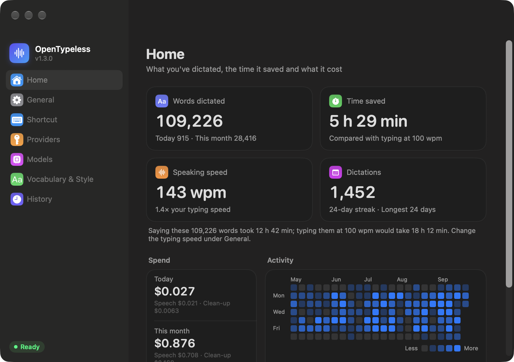

<p align="center">
  <a href="README.md">English</a> · <b>简体中文</b> · <a href="README.ja.md">日本語</a> · <a href="README.ko.md">한국어</a> · <a href="README.es.md">Español</a> · <a href="README.pt-BR.md">Português</a> · <a href="README.fr.md">Français</a> · <a href="README.de.md">Deutsch</a> · <a href="README.ru.md">Русский</a>
</p>

<p align="center">
  
</p>

<h1 align="center">OpenTypeless</h1>

<p align="center">
  <b>macOS 和 Windows 上的原生语音输入，长段口述也不会出问题。</b><br>
  按住一个键，想说多久就说多久，光标处得到干净、有条理的文字。
</p>

<p align="center">
  
</p>

<p align="center">
  
</p>

<p align="center">
  两个原生应用，一套设计：<b>macOS</b>（Swift / SwiftUI）和 <b>Windows</b>（C# / WinUI 3）。<br>
  相同的处理流程、相同的整理提示词、相同的设置和失败处理；只有系统集成和外观不同。
</p>

---

## 为什么做这个

语音输入是给 AI 工具写长提示词最快的方式。这也意味着口述往往很长：边想边说一到三分钟很正常。

大多数语音输入应用，无论开源还是商业，说一句话没问题，**偏偏在这种长段口述上出错**。录 40 秒、1 分钟或 2 分钟，结果是超时、空白，或者文字丢失。读过几个开源替代品的源码后，发现根源总是那几个：

- **整段录音作为一次语音转文字请求发出去。** 上游服务商处理超过约 60 秒就会超时（OpenRouter 在文档里明确写了），所以说得越久，请求越可能失败。
- **整理文字的 LLM 调用有一个很短的*总*超时。** 30 秒的上限把流式输出也算进去，长回答会被拦腰截断。
- **一次失败就全部作废。** 两分钟的话没了，只能从头再说一遍。

OpenTypeless 就是围绕这个问题做的。

## 长段口述是怎么处理的

| | 做法 |
|---|---|
| **在停顿处切分** | 你说话时，音频会在每一段里最安静的 0.4 秒处切成 18–28 秒的片段，词不会被切成两半，也没有请求会接近上游 60 秒的限制。 |
| **边说边转写** | 每个片段一切出来就在后台转写。两分钟的口述，松开按键时只剩最后几秒需要处理。 |
| **按片段重试** | 网络中断、429 和 5xx 错误会带退避地重试；Key 无效和余额问题会立即报错。一个片段失败不影响其他片段，失败的片段在最后还会再整轮重试一次。 |
| **慢启动时启用备用模型** | 如果整理模型 0.55 秒内还没开始输出，或者请求失败，就同时请求另一家厂商的备用模型，谁先出字用谁。上游变慢最多多花不到一秒，而不是整段等待。 |
| **空闲超时，而不是总超时** | 整理步骤以流式返回结果，只有连续 25 秒*没有任何*数据才算卡住，所以长输出永远不会被截断。 |
| **一个字都不丢** | 音频边说边写入磁盘。每次听写都保存在历史里；失败的可以稍后重试，而且只重新发送失败的片段。如果整理失败，就插入原始转写。 |

例如一段 121 秒的合成口述会在自然停顿处切成 6 段。说话人停下时，其中 5 段已经转写好了。

## 整理出来像你亲手打的

原始的语音转文字很乱：口头禅、重说、“不对，我是说……”、边想边说。整理步骤会把它变成你本来会打出来的样子：

- **自我修正以最后一次为准。** “周三，不对，周四” → 周四。包括隔了很久才改口的、隐含的修正（“5 万，呃，保险起见 6 万吧”），以及整条撤回的内容（“……第三点，算了不要了”）。
- **去掉口头禅和自言自语。** um / uh / 嗯 / 那个 / “让我想想” / “差不多就这样” 都会去掉。
- **真实内容一点不丢。** 数字、版本号、名字和比较都原样保留。模型被告知，比它知道的更新的产品也是真实存在的，所以 “Gemini 3.5” 不会被改成 “Gemini 2.5”。
- **需要时才加结构。** 三个及以上并列要点变成编号列表；其余保持普通段落。
- **从不回答你。** 口述的提示词（“你能解释一下为什么……”）只会被整理，不会被回答或执行。
- **你的用词、你的语言。** 改动尽量少：措辞、顺序和语气都保持原样。中英混说时，每个词都保留你说出它时的语言，日常词也一样（“shortcut”、“dark mode”），中文和英文之间加空格。

<p align="center">
  
</p>

提示词在开发集和留出测试集上调优（见 [eval/](eval/)），其中包括真实的口述。

## 功能

- **全局快捷键。** 默认按住 **Fn**（macOS）或 **右 Alt**（Windows），也可以录制任意单个修饰键（右 ⌘、右 ⌥、右 Ctrl……）或组合键（⌥ Space、Alt + Space、F5……）。
- **按住说话或免手持。** 按住说话；轻点一下进入免手持录音，再点一下结束。**Esc** 取消。说满 10 秒后按 Esc 取消，内容不会丢：会转写成文字（不插入），在历史里保留 24 小时。
- **选择麦克风**：在 **设置 → 通用** 里选择，并用实时音量条确认它能听到你。虚拟设备（会议、直播软件）会单独标出，选中的设备断开时自动改用系统默认输入。
- **预热麦克风**（可选）：按下快捷键立刻开始录音，并带上按键前的一小段，第一个字不会被吞掉。麦克风会一直开着，蓝牙耳机会切到通话模式。
- **实时预览（测试版）**：说话时在录音条上方显示识别到的文字，由系统本地识别（macOS 用 SpeechAnalyzer，Windows 用系统语音识别）。插入的文字仍然来自你的服务商。
- **粘贴到光标所在位置。** 在输入框里会直接粘贴，并恢复你原来的剪贴板；没有聚焦输入框时则复制到剪贴板。浏览器和 Electron 应用也能用，Windows 上的终端也可以。
- **插入后自动回车**（可选）：文字粘贴进去后自动按一次回车，在聊天框或给 AI 写提示词时说完就直接发出去。
- **录音时静音**（可选）：录音期间把扬声器静音，音乐和视频不会打扰你说话，结束后自动恢复。
- **自带服务商。** OpenRouter、OpenAI、Groq、硅基流动 SiliconFlow、DeepSeek，或任何兼容 OpenAI 接口的服务。语音转文字、文字整理和备用整理模型可以各用不同的服务商。**测试** 会检查 Key，并显示服务商的往返延迟（三次取中位数）。
- **备用语音转文字**（可选）：某一段比这条线路按长度通常需要的时间慢很多，或者失败时，同时请求第二个服务商，用先返回的结果。
- **自定义词汇表和风格偏好**，用于人名、产品名和专业术语。支持的语音模型（Microsoft MAI-Transcribe、OpenAI 的转写模型和 Whisper、AssemblyAI）还会把词汇表当作拼写提示，少见的名字在整理之前就能写对。
- **从你的修改中学习。** 粘贴后把识别错的词改过来（TypeList → Typeless），它就会连同被听成的样子自动加进词汇表。读不到输入框的应用（微信、Firefox、Claude、Discord、Slack 这类 Electron 应用）会改为跟随你粘贴后按的键。只学发音相近的修改，不学改写、改数字或普通的换词；你删掉的词不会再被学回来。
- **主页**展示语音输入帮你做了多少事：说了多少字、比打字省了多少时间（默认每分钟 100 字，可调）、你的说话速度、今天、本月和累计的花费，以及带连续天数的 GitHub 风格活跃度热力图。手动打开应用时会显示主页；登录自动启动时不打扰你，除非打开 **自动启动时打开主页**。
- **清楚知道花了多少钱。** OpenRouter 的请求按 OpenRouter 实际扣费计算，每个模型旁边都会显示它的实时价格。其他服务商或自定义接口，可以在 **模型** 里填写价格（每百万 token，语音转文字按每分钟音频）。
- **历史**记录每一次听写，按天分组、可以搜索，包括原始文字和整理后的文字、耗时、花费、复制和重新转写。录音保存多久由你决定：不保存、一天、一周、一个月、一年或永久。
- **九种界面语言**：English、简体中文、日本語、한국어、Español、Português、Français、Deutsch 和 Русский。默认跟随系统语言，也可以在 **设置 → 通用 → 界面语言** 里选择。
- **原生设计。** macOS 26+ 上是 Liquid Glass 和菜单栏面板；Windows 11 上是 Mica 和 Acrylic，以及托盘面板。说话时两边都会显示一个小小的录音胶囊。
- **登录时自动启动。**
- **自动更新。** 每天检查一次 GitHub Releases，在后台下载新版本，你点 **重启更新** 时才安装，绝不会在听写中途进行。替换任何文件之前都会用 GitHub 的 SHA-256 校验下载内容。可以在 **设置 → 通用 → 更新** 里关闭或手动检查。
- **小巧、原生。** macOS 上是约 3 MB 的 Swift/SwiftUI 应用，Windows 上是自包含的 WinUI 3 应用。没有 Electron，不需要账号，也没有自己的服务器。

<p align="center">
  
</p>

<table>
  <tr>
    <td width="50%"></td>
    <td width="50%"></td>
  </tr>
  <tr>
    <td align="center">为每个步骤选择服务商和模型，显示实时价格，外加备用</td>
    <td align="center">词汇表，包括从你的修改中学到的词</td>
  </tr>
</table>


## 系统要求

- **macOS：** macOS 26 或更高版本，Apple 芯片或 Intel 芯片均可（能装 macOS 26 的 Intel Mac：2019 款 16 英寸 MacBook Pro、2020 款四个雷雳接口的 13 英寸 MacBook Pro、2020 款 iMac 和 2019 款 Mac Pro）。
- **Windows：** Windows 10（2004 或更高版本）或 Windows 11，x64 或 ARM64。
- 至少一家服务商的 API Key（[OpenRouter](https://openrouter.ai/keys) 最省事：一个 Key 就能覆盖两个步骤）。

## 在 macOS 上安装

### Homebrew

```bash
brew install --cask tyler913/tap/opentypeless
```

Homebrew 会自动选对应芯片的版本，也会替你完成下面的去隔离步骤。之后应用会自己更新，`brew upgrade` 也能跟上。

### 下载

1. 从 [Releases](https://github.com/Tyler913/OpenTypeless/releases) 下载磁盘映像：Apple 芯片（M1 及以后）选 `OpenTypeless-<version>-macOS-arm64.dmg`，Intel Mac 选 `-macOS-x64.dmg`。（不确定的话看 苹果菜单 → 关于本机：显示“芯片 Apple M…”还是“处理器 Intel”。）
2. 打开它，把 **OpenTypeless** 拖到 **应用程序** 文件夹。
3. 这个应用没有经过 Apple 公证（公证需要付费开发者账号），所以 macOS 第一次打开时会拦截，甚至可能提示“已损坏，无法打开”。在终端里移除一次下载隔离标记：

   ```bash
   xattr -dr com.apple.quarantine /Applications/OpenTypeless.app
   ```

   然后正常打开：

   ```bash
   open /Applications/OpenTypeless.app
   ```

   或者先尝试打开一次，再到 **系统设置 → 隐私与安全性** 里点 **仍要打开**。

OpenTypeless 待在菜单栏（波形图标）里，不在程序坞中。

之后的版本可以在应用内安装（**设置 → 通用 → 更新**），不需要再用终端：macOS 只会对通过浏览器下载的应用进行询问。

### 从源码构建

需要安装 Xcode 26+（只有命令行工具也能编译，但构建时会借用 `/Applications/Xcode.app` 里的 SwiftUI 宏插件）。

```bash
git clone https://github.com/Tyler913/OpenTypeless.git
cd OpenTypeless/macos
scripts/create-signing-cert.sh   # 可选但推荐，只需一次
scripts/build-app.sh             # 构建、签名并安装到 /Applications/OpenTypeless.app
```

`create-signing-cert.sh` 会创建一个本地代码签名身份。没有它，应用会用临时（ad hoc）签名，每次重新构建后 macOS 都会重新请求辅助功能和麦克风权限。

如果要打包发布用的文件而不是安装：`scripts/build-app.sh --package` 会生成 `macos/dist/OpenTypeless-<version>-macOS-arm64.dmg` 和 `.zip`（Intel Mac 上是 `-macOS-x64`，临时签名）并打印它们的 SHA-256。

`build-app.sh` 会保证机器上只有一份应用。它在一个隐藏的暂存文件夹里组装应用包，移动到 `/Applications`，从 LaunchServices 注销旧副本，并在签名变化时清理过期的隐私授权记录。

### 首次运行

第一次启动会打开一个简短的引导：欢迎页、填写 API Key（推荐 OpenRouter，附创建链接；会设置好 `microsoft/mai-transcribe-2` 和 `google/gemini-3.1-flash-lite`），再在一个输入框里试一次听写。每一步都可以跳过，引导只出现这一次。如果跳过了：

1. 授予 **麦克风** 和 **辅助功能** 权限（辅助功能用来监听快捷键和粘贴文字）。
2. 在 **设置 → 服务商** 里添加 API Key。
3. 如果使用 Fn，建议把 **系统设置 → 键盘 → “按下 🌐 键时”** 设为 **不执行任何操作**，这样轻点 Fn 就不会弹出表情面板。

## 在 Windows 上安装

### 安装包（推荐）

1. 从 [Releases](https://github.com/Tyler913/OpenTypeless/releases) 下载 `OpenTypeless-<version>-windows-x64-setup.exe`（ARM 版 Windows，比如骁龙笔记本，选 `-arm64-setup.exe`）。
2. 运行它。应用没有代码签名，所以 SmartScreen 可能会提示“Windows 已保护你的电脑”：点 **更多信息 → 仍要运行**。

它只为当前用户安装，不需要管理员权限，装到 `%LOCALAPPDATA%\Programs\OpenTypeless`，并添加开始菜单项、桌面快捷方式（可以取消勾选，默认勾选）和 **设置 → 应用** 里的条目，从那里可以卸载。卸载时你的设置、历史记录和 API Key 会保留。

### 绿色版

不想安装？下载 `OpenTypeless-<version>-windows-x64.zip`（或 `-arm64`），解压到你有写权限的任意位置（例如 `%LOCALAPPDATA%\Programs`），运行 **OpenTypeless.exe**。它是自包含的：不需要装 .NET 或任何东西，除了 `%LOCALAPPDATA%\OpenTypeless` 里的设置，不会往文件夹外写东西。它没有开始菜单项和卸载程序：删掉文件夹就卸载了。

两种方式之后的版本都可以在应用内安装（**设置 → 通用 → 更新**），装到同一个文件夹，不会再弹 SmartScreen。如果放在 `Program Files` 里，应用只能给你一个下载链接。

OpenTypeless 待在**通知区域**（时钟旁边的波形图标）里。Windows 一开始会把新图标藏在溢出区（^）；把它拖到任务栏上，或者在 **设置 → 个性化 → 任务栏 → 其他系统托盘图标** 里打开它。

### 从源码构建

需要 [.NET 10 SDK](https://dotnet.microsoft.com/download)。Visual Studio 可选。

```powershell
# 在本仓库克隆目录的 windows\ 下
powershell -ExecutionPolicy Bypass -File scripts\build.ps1            # 测试、构建，并安装到 %LOCALAPPDATA%\Programs\OpenTypeless
powershell -ExecutionPolicy Bypass -File scripts\build.ps1 -Package   # 生成 windows\dist\OpenTypeless-<version>-windows-x64.zip 和 -setup.exe
```

`build.ps1` 会保证只安装一份：停止正在运行的应用，替换安装文件夹，刷新开始菜单快捷方式，然后启动新版本。ARM 版 Windows 加上 `-Arch arm64`。打包安装程序需要 [Inno Setup 6](https://jrsoftware.org/isinfo.php)（`winget install JRSoftware.InnoSetup`），脚本在 [`windows/installer/OpenTypeless.iss`](windows/installer/OpenTypeless.iss)。

开发 Windows 应用不需要 Windows 电脑：每次改动 GitHub Actions 都会构建它（见[持续集成](#持续集成)）。

### 首次运行

第一次启动会打开和 macOS 一样的简短引导（填写 API Key，再按住右 Alt 试一次听写）。每一步都可以跳过，引导只出现这一次。如果跳过了：

1. 在 **设置 → 服务商** 里添加 API Key。
2. 确认 **设置 → 隐私和安全性 → 麦克风 → 允许桌面应用访问你的麦克风** 已打开。
3. 按住右 Alt 说话（不用右 Ctrl，是因为 Copilot+ 电脑把它换成了 Copilot 键；德语、法语等键盘布局里右 Alt 是 AltGr，可以在 **设置 → 快捷键** 里换一个）。Windows 不需要辅助功能权限；唯一的限制是它不允许粘贴到以管理员身份运行的应用，这时文字会放到剪贴板里。

## 默认模型

| 步骤 | 默认 | 说明 |
|---|---|---|
| 语音转文字 | `microsoft/mai-transcribe-2`（OpenRouter） | 任何 OpenRouter 转写模型，或其他服务商兼容 Whisper 的 `/audio/transcriptions`。 |
| 文字整理 | `google/gemini-3.8-flash`（OpenRouter） | 我们测试中整理效果最好，一段长口述约 0.005 美元。更便宜的可以试试：`qwen/qwen3.7-flash`、`google/gemini-3.1-flash-lite`（最快，首次启动引导里填 OpenRouter Key 时用的就是它）。 |
| 备用整理 | `deepseek/deepseek-v4.1-flash`（OpenRouter） | 只有主模型启动慢或失败时才会请求。选一个其他厂商的快速模型。 |

整理模型的推理（reasoning）会自动关闭或设到最低，以降低延迟。

## 隐私

- 音频和文字只会发送给你配置的服务商。打开 **实时预览** 时，macOS 在本机识别语音；Windows 使用系统自带的语音识别，开启在线语音识别时语音会发送给微软（设置里有说明）。
- API Key 在 macOS 上保存在 `~/Library/Application Support/OpenTypeless/credentials.json`，仅当前用户可读（不用钥匙串：自签名的 app 每次更新后钥匙串都会再要一次密码），或 Windows 凭据管理器（一条记录，`OpenTypeless/credentials`）。
- 主页的使用统计（每天的字数、说话时长和花费，不含文字）保存在 `usage.json` 里，和设置、历史在同一个文件夹。OpenRouter 价格表每天从它公开的模型列表下载几次（不需要 Key，不含任何关于你的信息）。
- 历史（音频 + 转写）在 macOS 上位于 `~/Library/Application Support/OpenTypeless/Sessions/`，在 Windows 上位于 `%LOCALAPPDATA%\OpenTypeless\`。录音默认保存一个月（在历史页面可选：不保存、一天、一周、一个月、一年或永久）；之后文字仍保留在最新的 200 条记录里。转写失败的听写会保留音频，方便重试。
- 检查更新每天向 `api.github.com` 发送一次请求（不需要账号，不含任何关于你或你的听写的信息）；可以在 **设置 → 通用 → 更新** 里关闭。
- 从你的修改中学习时，只在你的电脑上读取你听写进去的那个输入框，读不到时跟随你在那里按的键；最多在粘贴后两分钟内，切换应用或发送后就停止。为了知道你双击选中了哪个词，可能会用 ⌘C / Ctrl+C 复制一下选中的文字，你的剪贴板会马上恢复原样。密码框会跳过。可以在 **词汇与风格** 里关闭。

## 开发

仓库里同时包含两个应用。它们共享设计、评测集和这份 README；各自有自己的代码、测试和构建脚本。

```
macos/                      macOS 应用（Swift Package）
  Sources/TypelessCore/       处理流程逻辑，不含 UI：切分器、WAV、服务商客户端、重试、整理提示词
  Sources/OpenTypeless/       应用本身：快捷键、录音、HUD、设置、历史、粘贴、命令行工具
  Tests/                      swift-testing 测试
  scripts/                    构建、签名、图标和测试脚本
windows/                    Windows 应用（.NET 解决方案）
  src/TypelessCore/           同样的处理流程逻辑，逐行移植
  src/OpenTypeless/           WinUI 应用：快捷键钩子、WASAPI 录音、HUD、托盘、设置、历史、粘贴
  src/OpenTypeless.Cli/       命令行工具（转写文件、切分分析、提示词评测）
  tests/                      xUnit 测试
  scripts/                    构建、测试和图标脚本
eval/                       整理测试集和评测指南，两个应用共用
i18n/                       界面翻译（中文和英文以外的语言），两个应用共用
docs/DESIGN.md              架构和设计决策
docs/WINDOWS-PORT.md        每个 macOS 文件和系统 API 在 Windows 上的对应
docs/images/                README 截图
```

整理提示词（`Prompts.swift` / `Prompts.cs`）在两个应用里逐字节相同；要改就两边一起改，并用 [eval/](eval/) 检查效果。

### 翻译

每条面向用户的文字都以内联方式写出中文和英文：Swift 中是 `L("有新版本 \(version)", "Version \(version) is available")`，C# 中是 `L($"有新版本 {version}", $"Version {version} is available")`。其他语言放在 [`i18n/strings.json`](i18n/strings.json) 里，以英文文本为键，其中的插值按顺序编号：

```json
"Version {0} is available": { "ja": "バージョン {0} が利用可能です", "ko": "버전 {0} 사용 가능", … }
```

两个应用在构建时都会嵌入这个文件，没有翻译的文字会显示英文。翻译可以调整占位符的位置，但每个占位符都必须保留。新增或修改文字后，补上翻译并运行 `python3 i18n/check.py`：它会列出缺失、未使用和格式有误的条目，CI 也会在每个拉取请求上运行它。要在界面里检查某种语言，可以用 `--snapshot-ui` 加 `--lang ja`（或其他语言代码）渲染界面。

### macOS

```bash
cd macos
swift build
scripts/test.sh                  # 单元测试，包括一个向 130 秒录音注入故障的模拟服务器
scripts/perf.sh                  # 发布版构建下的性能预算（音频处理、主线程上的工作），CI 也会运行
```

构建出的程序有一些实用的命令行模式（在 `macos/` 下运行）：

```bash
# 对音频文件跑完整流程；--realtime 按说话速度送入音频，像实时麦克风一样
.build/debug/OpenTypeless --transcribe-file speech.m4a --realtime

# 查看切分器在哪里切
.build/debug/OpenTypeless --transcribe-file speech.m4a --chunks-only

# 评测整理提示词和模型（见 eval/README.md）
.build/debug/OpenTypeless --eval-polish ../eval/polish-holdout.json --model google/gemini-3.8-flash ...

# 把设置页面、菜单栏面板和 HUD 渲染成 PNG（--live 在屏幕上显示，得到真正的 Liquid Glass）。
# README 截图使用示例历史和 --demo（把权限视为已授予）。
OPENTYPELESS_SUPPORT_DIR=/path/to/sample-data .build/debug/OpenTypeless --snapshot-ui /tmp/shots --live --demo --lang en
```

### Windows

```powershell
cd windows
dotnet build OpenTypeless.slnx
scripts\test.ps1       # 单元测试，包括一个向 130 秒录音注入故障的模拟服务器
scripts\perf.ps1       # 发布版构建下的性能预算（音频处理、UI 线程上的工作），CI 也会运行
```

命令行工具（`OpenTypeless.Cli.exe`，和应用放在一起发布；使用应用的设置和 Key）：

```powershell
# 对音频文件跑完整流程（WAV、MP3、M4A、WMA、FLAC……）；--realtime 按说话速度送入音频
OpenTypeless.Cli --transcribe-file speech.m4a --realtime

# 查看切分器在哪里切
OpenTypeless.Cli --transcribe-file speech.m4a --chunks-only

# 评测整理提示词和模型（见 eval/README.md）
OpenTypeless.Cli --eval-polish ..\eval\polish-holdout.json --models google/gemini-3.8-flash --out ...

# 把每个设置页面、托盘面板和各个 HUD 状态渲染成 PNG
# （--lang en|zh|ja|… 只渲染一种语言，--demo 把权限视为已授予；配合 OPENTYPELESS_DATA_DIR 和示例历史使用）
OpenTypeless --snapshot-ui C:\temp\snapshots
```

开发用环境变量（Windows）：

| 变量 | 作用 |
|---|---|
| `OPENROUTER_API_KEY` | 覆盖保存的 OpenRouter Key。 |
| `OPENTYPELESS_DATA_DIR` | 使用另一个文件夹存放设置和历史（方便测试）。 |
| `OPENTYPELESS_DEBUG` | 把快捷键 / 会话 / 焦点事件写入数据文件夹里的 `debug.log`。 |
| `OPENTYPELESS_TEST_AUDIO` | 用一个 16 kHz 单声道 WAV 代替麦克风实时输入，用于端到端测试。 |

### 参与贡献

`main` 分支受保护：所有改动都要通过拉取请求。在分支上开发，向 `main` 发起拉取请求，等 **CI passed** 检查通过后合并。

### 持续集成

GitHub Actions（[`.github/workflows/`](.github/workflows/)）只构建你改动过的应用：

| 你改动了 | 会运行什么 |
|---|---|
| `macos/**` | 在 Apple 芯片和 Intel 两台运行器上执行 **macOS build**：先测试，再各自打包磁盘映像和 zip，检查并启动一遍。 |
| `windows/**` | 在 x64 和 ARM64 两台运行器上执行 **Windows build**：先测试，再各自打包绿色版 zip 和安装程序；实际运行安装程序、启动应用，再卸载一遍。 |
| `testdata/**` | 两边都构建：两个测试套件共同读取的测试用例（字数、价格、节省的时间），保证两个应用结果一致。 |
| `i18n/**` | 两边都构建：两个应用都会嵌入的翻译。 |
| 只改了 `docs/`、`eval/`、`README*.md` | 什么都不构建。 |

每次运行还会检查翻译（**Translations**，`python3 i18n/check.py`）。

在 Actions 页面某次运行的 **Artifacts** 部分可以下载构建结果。**Actions → macOS build / Windows build → Run workflow** 可以手动触发构建。

发布时，把两个应用里的版本号都改掉（`macos/scripts/build-app.sh`、`windows/Directory.Build.props`），然后推送一个标签，`1.0.2`（或 `V1.0.2`）。它会构建两个应用，并创建一个名为 “OpenTypeless V1.0.2” 的**草稿**发布，包含八个文件：Apple 芯片和 Intel 的 macOS 磁盘映像和 zip（用发布证书签名），以及 x64 和 ARM64 的 Windows 安装程序和绿色版 zip。缺少任何一个，或者版本和标签不一致，构建都会失败。

检查草稿后手动发布，它就会成为最新版本。已安装的副本会在一天内发现它：应用内更新器会查找最新的、已发布的、非预发布版本中带有对应平台 zip 的那个（`OpenTypeless-<version>-macOS-arm64.zip`、`-macOS-x64.zip`、`-windows-x64.zip`、`-windows-arm64.zip`）。把某个发布标记为预发布，就不会推送给用户。发布后还会自动更新 [Homebrew tap 和 WinGet](packaging/README.md)。

**macOS 发布签名（一次性）。** macOS 把辅助功能和麦克风权限绑定在应用的签名上，所以发布版本应该一直用同一个证书签名；否则每次更新后用户都要重新授予这两项权限。运行 `macos/scripts/create-release-cert.sh`，把它生成的 `.p12` 保存在私密的地方，并添加它打印出的两个仓库密钥（`MACOS_SIGNING_CERTIFICATE`、`MACOS_SIGNING_CERTIFICATE_PASSWORD`）。之后发布构建就会用它签名；没有这些密钥时会使用临时签名，并在运行中给出警告。

## 致谢

灵感来自 Typeless。系统集成的做法借鉴了开源的 [VoiceInk](https://github.com/Beingpax/VoiceInk)、[OpenLess](https://github.com/Open-Less/openless) 和 [OpenTypeless (tover0314-w)](https://github.com/tover0314-w/opentypeless)。本项目独立开发，与它们均无关联。

## 许可证

[MIT](LICENSE)
